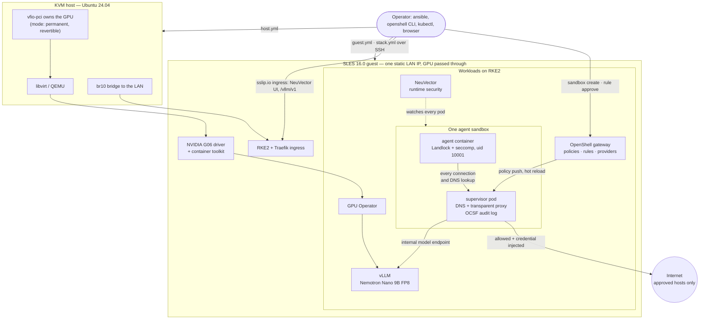

# agentic-secops-lab

**TL;DR** — the SUSE/NVIDIA agentic SecOps stack from
[*We Gave Our Agents Autonomy. Here's How We Kept Control*][suse-post],
rebuilt on **one workstation**: a SLES 16.0 KVM guest with a consumer GPU passed
through, RKE2, the NVIDIA GPU Operator, SUSE Security (NeuVector), vLLM serving
a Nemotron model, and NVIDIA OpenShell running a real agent sandbox. Three
Ansible playbooks build all of it from a fresh Ubuntu host and a SLES trial. A
[test directory](test/) then checks what SUSE says about the sandbox against
the running system and records the outcome in [test/results.md](test/results.md).

> **Need the GPU back on the host, or back in the guest?** The switch is one
> variable, one playbook and one reboot in either direction —
> **[docs/gpu-modes.md](docs/gpu-modes.md)**.

## What it is

A working, single-VM version of the public half of that architecture, built
and verified end to end, plus the notes and inventory that went into it:

- **The platform.** Ubuntu 24.04 KVM host with the GPU bound to vfio-pci,
  a SLES 16.0 guest on a bridged LAN address, NVIDIA G06 driver, RKE2 with
  Traefik ingress — all from `ansible/host.yml` and `ansible/guest.yml`.
- **The stack.** GPU Operator, NeuVector with its UI behind ingress, vLLM
  serving Nemotron Nano 9B (FP8) on the one GPU with an OpenAI-style API,
  and the OpenShell gateway with the Agent Sandbox CRDs and CLI — from
  `ansible/stack.yml`, each piece behind its own switch.
- **The proof.** Scripts under `test/` that create a sandbox and exercise
  the claims one by one: egress denied until a human approves a rule and
  allowed without a restart afterwards, Landlock keeping system paths and
  shell profiles read-only, seccomp with no privilege path, no Kubernetes API
  from inside, credentials injected by the supervisor rather than handed to
  the agent, and every decision recorded as an OCSF event outside the
  sandbox. Each test prints the evidence it saw.
- **The reading.** A component inventory with licences, what fits on one
  VM and what does not, GPU sizing, and how to move the GPU between host and
  guest.

What it costs to reproduce: one machine with a supported GPU, a
[60-day SLES trial](docs/sles-kvm.md#getting-sles-without-a-subscription),
and an afternoon.

What lives here:

- **[Component inventory](docs/components.md)** — all 29 named components with their
  licences, and which are actually integrated today versus announced.
- **Install notes** — [what fits on one VM](docs/single-vm.md),
  [SLES and KVM setup](docs/sles-kvm.md), [GPU sizing](docs/gpu-sizing.md),
  and [moving the GPU between host and guest](docs/gpu-modes.md).
- **[Ansible](ansible/)** — three playbooks: build the VM on the KVM host,
  provision it, then install the stack on it. See its README.
- **[Claim tests](test/)** — scripts that put SUSE's statements about the
  sandbox (deny-by-default egress, Landlock, seccomp, proxied credentials,
  OCSF audit) to the test on the running lab, with the
  [recorded results](test/results.md).

## How it fits together

The agent never holds a credential and never talks to the network directly:
DNS answers are synthetic addresses that only the supervisor can route, so a
name that no approved rule covers is refused before a packet leaves the pod,
and the refusal shows up as a pending rule for a human. [test/](test/) shows
each of those steps happening.

## What this is not

This is **not** the reference architecture. SUSE's design assumes a datacentre:
multiple clusters, 8×H100-class inference for the planner model, and BlueField-4
DPUs enforcing policy in a separate compute domain. None of that fits on a
workstation.

It started as notes compiled from SUSE's and NVIDIA's published material,
worked through to the point of "would this deploy". It has since been built
for real on one machine — an Ubuntu 24.04 host with a Ryzen 9900X and an RTX
4080 Super, a SLES 16.0 guest — up to a running OpenShell sandbox, and the
Ansible encodes what that took. Where something is still unverified it says
so. Corrections welcome — open an issue.

Three specific limits worth knowing before you start:

| | |
|---|---|
| **OpenShell is alpha** | NVIDIA's own framing is "one developer, one gateway" |
| **The SecOps agents aren't public** | they ship as SUSE AI Factory blueprints; no public repo |
| **Nemotron 3 Ultra doesn't fit** | swap in Lightning or Nano for the planner role |

Host is Ubuntu 24.04 LTS, guest is SLES 16.0 — only the guest has to be SUSE, and
a [60-day trial](docs/sles-kvm.md#getting-sles-without-a-subscription) is enough to
build the whole thing.

## Why it's still worth doing

The interesting claim in SUSE's post is architectural, not about scale: agents get
autonomy because a sandbox holds the credentials and the egress policy, not because
the agent is trusted. That property is testable on one machine. The DPU layer adds
a second, hardware-enforced line — but SUSE describes OpenShell on its own as a
complete deployment.

## Licence summary

By code licence, nearly everything in the pipeline is open source. The exceptions:

- **NIM** — needs an NVIDIA AI Enterprise licence (also serves NeMo Retriever)
- **SUSE Observability** — closed; SUSE has said a Community Edition lands in 2027
- **Nemotron models** — open *weights* under NVIDIA's Open Model License and
  OpenMDW-1.1, which is not the same as OSI-approved open source
- **Sentry / DOCA / BlueField-4 / Vera** — proprietary or hardware, and not
  integrated yet

SLES and Rancher Prime are open-source code sold by subscription — commercial
access, not a commercial licence. See [components.md](docs/components.md) for the
per-component breakdown.

## Sources

Everything here derives from SUSE's and NVIDIA's public material; nothing is quoted
at length. See [Sources](docs/components.md#sources).

[suse-post]: https://www.suse.com/c/we-gave-our-agents-autonomy-heres-how-we-kept-control/
